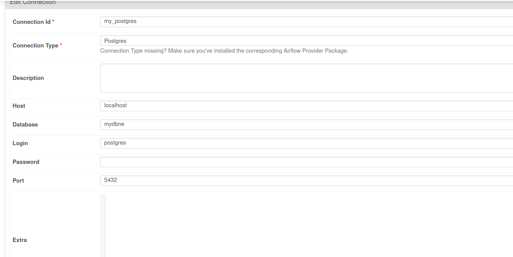
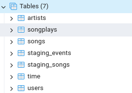
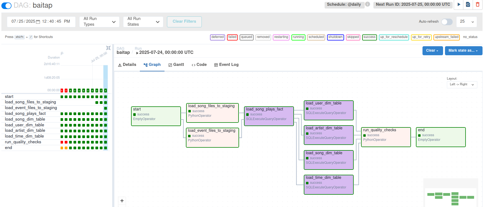
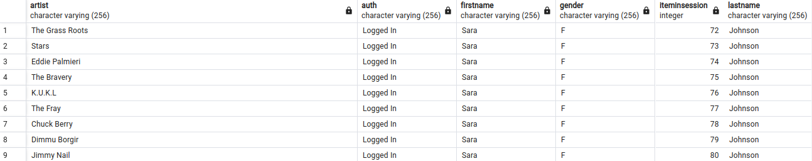

# Vấn đề với thiết kế warehouse của đề bài
Phân tích dữ liệu từ folder log_data, có nhiều trường hợp user có nhiều level khác nhau

Ví dụ: (userid: 80, level: paid), (userid: 80, level: free), nhưng userid là primary key của bảng dim users nên level chỉ có thể có 1 giá trị. Vì level đã có trong bảng fact, giải pháp là bỏ đi trường level trong bảng dim users

Các bước thực hiện bài tập:

Môi trường: Airflow 2.10.0, Postgresql 14.10

- Tạo connection trên airflow

- Dùng pgadmin tạo bảng:

- Graph sau khi chạy

Một vài bảng sau khi chạy

